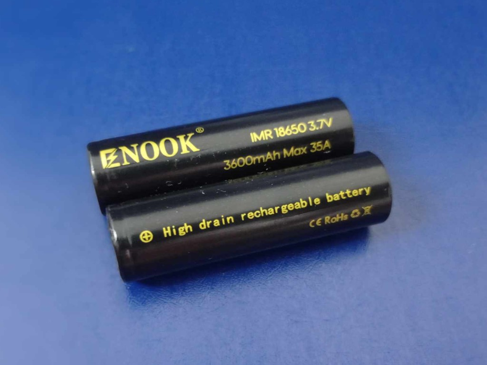
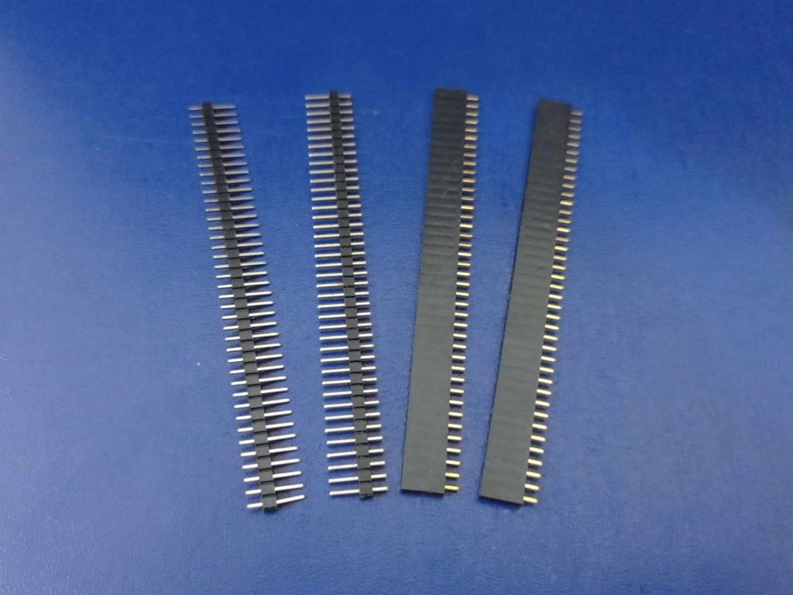
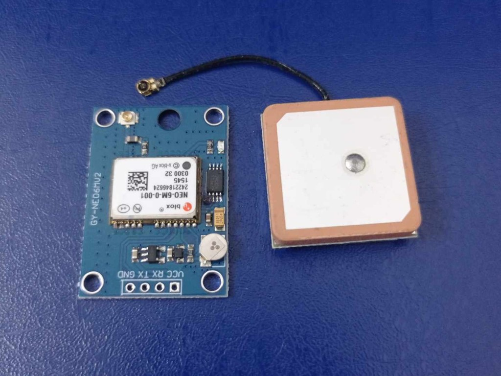
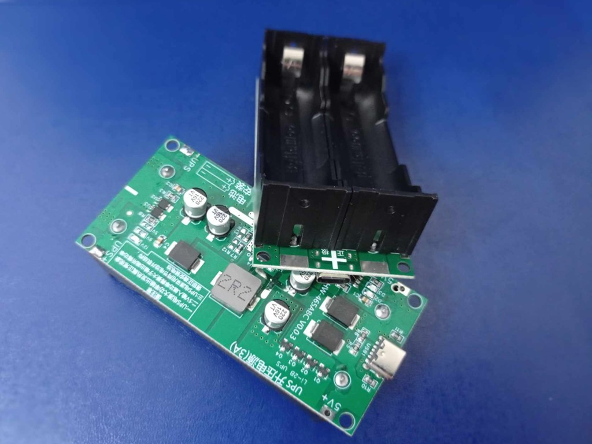

# GPS Tracker Prototype Kit

This repository contains all the components and resources for assembling and programming a GPS tracker prototype. The kit includes necessary hardware, a 3D printed casing, and sample Arduino codes to get started.

## Contents of the Kit

1. **2 pcs 18650 LiPo Battery**:  
   Provides power to the tracker.  
   

2. **1 5x7 Double-sided PCB Protoboard**:  
   Used for assembling the circuit.  
   

3. **2 Pairs of 40-pin Straight Pin Headers (Male & Female)**:  
   Used for easily connecting components.  
   

4. **1 NodeMCU ESP32 Dev Kit**:  
   The brain of the GPS tracker, responsible for processing and communication.  
   

5. **1 GPS Module (Neo-6M)**:  
   Used for real-time GPS tracking.  
   

6. **1 UPS Module with Battery Holder and Type-C Charging Port**:  
   Ensures uninterrupted power supply.  
   

7. **1 Heavy-duty USB to Micro USB Cable**:  
   Used for programming the ESP32.  
   

8. **Freebies**:  
   Includes sample Arduino codes, soldering wire, and solid wire.  
   

9. **3D Printed Casing**:  
   Protects the components and gives the tracker a sleek, portable form.  
   

---

## Getting Started

### Assembly Instructions

1. **PCB Assembly**:
    - Solder the NodeMCU ESP32 onto the 5x7 protoboard.
    - Attach the Neo-6M GPS module using the 40-pin headers.
    - Connect the UPS module to ensure power stability.
    - Use solid wire to make connections between components as per the circuit diagram provided. 

2. **Battery Setup**:
    - Insert the 18650 LiPo batteries into the UPS module's battery holder.
    - Ensure the Type-C charging port is accessible for recharging.

   

3. **Enclosure**:
    - Place the assembled tracker into the provided 3D printed casing.
    - Secure the casing with screws or clips as required.

   

4. **Programming**:
    - Connect the NodeMCU ESP32 to your computer using the heavy-duty USB to Micro USB cable.
    - Upload the sample Arduino code provided in the `/Freebies` folder.

   

### Sample Code

In the `/Freebies` folder, you will find Arduino code samples that handle:

- GPS data collection using the Neo-6M module.
- Data communication via the ESP32.

You can customize these codes according to your project’s specific requirements.

## Requirements

To use this GPS tracker prototype, you’ll need:

- **Arduino IDE**: For programming the ESP32.
- **USB Power Source**: To charge the batteries and power the board.

## How to Use

1. Upload the GPS tracker sketch from the `/Freebies` folder to your NodeMCU ESP32.
2. Once powered, the tracker will start acquiring location data via the Neo-6M GPS module.
3. The data can be processed and transmitted depending on your application (e.g., displayed on a web interface, stored on a server, etc.).

## License

This project is open source and free to use for personal or educational purposes.

---
